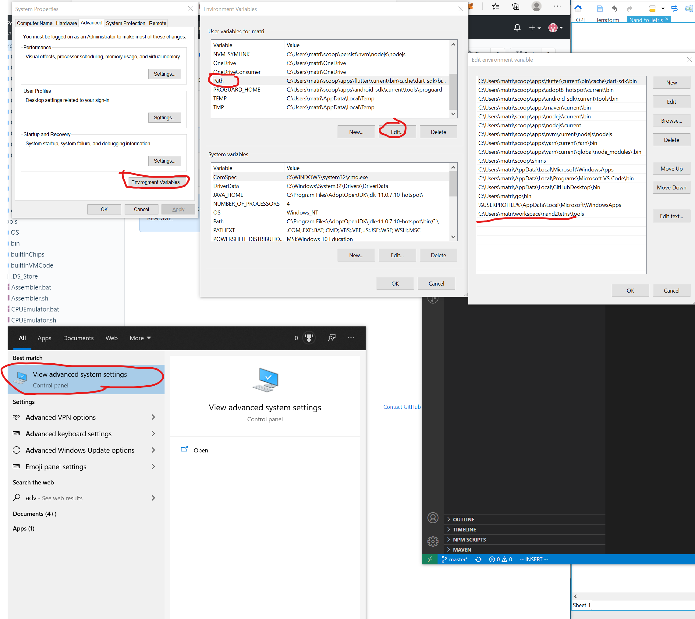
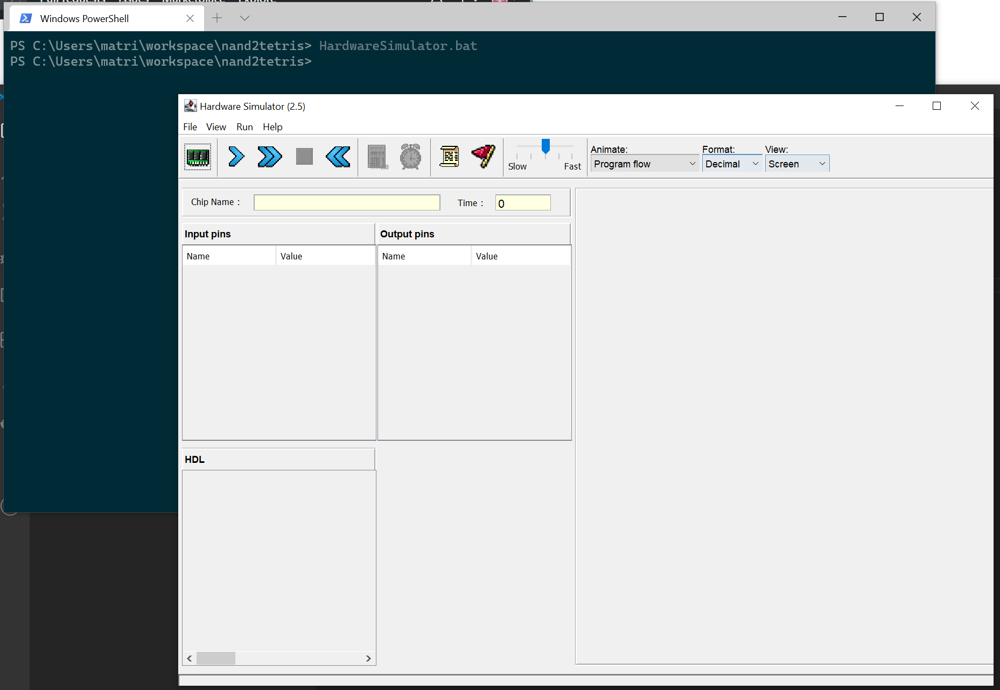

Add the `tool` folder to Windows PATH
1. search for `View Advanced System Settings`
2. Click `Environment Variables`
3. Edit the `Path` entry to include the correct folder

You can **verify** the setting is correct by typing in `HardwareSimulator.bat` in your PowerShell.
